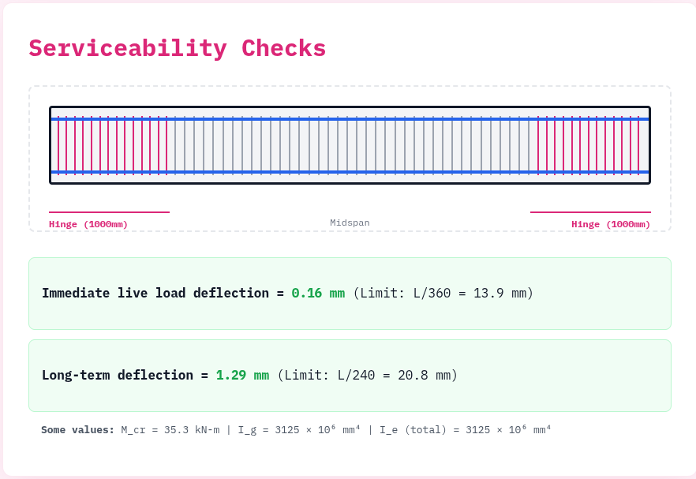
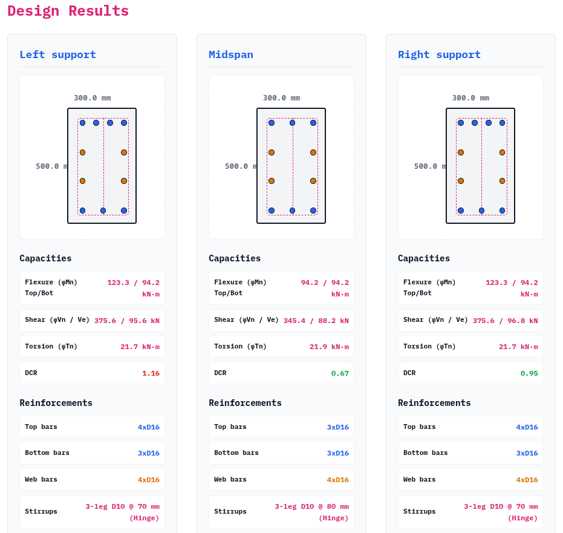
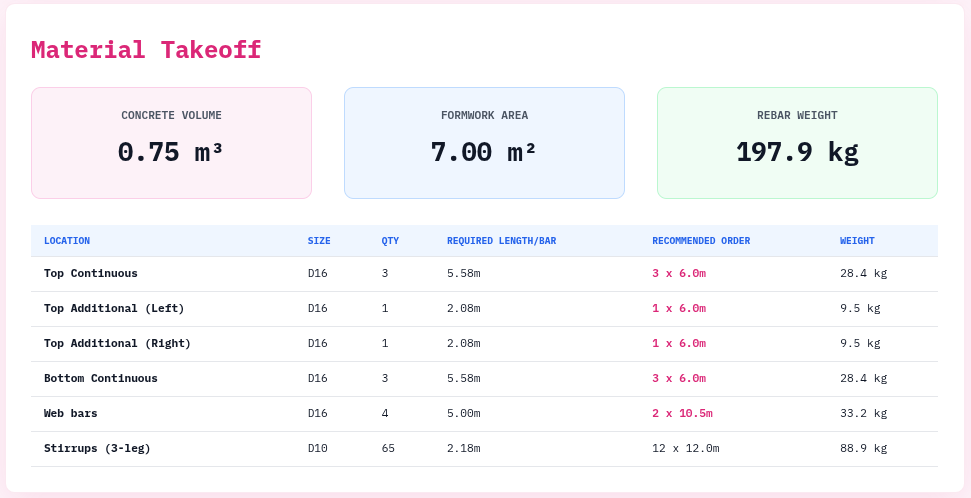
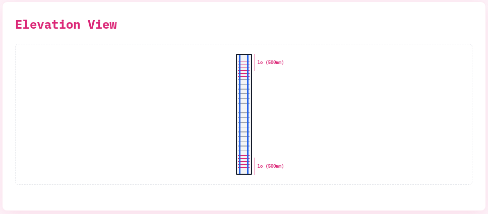
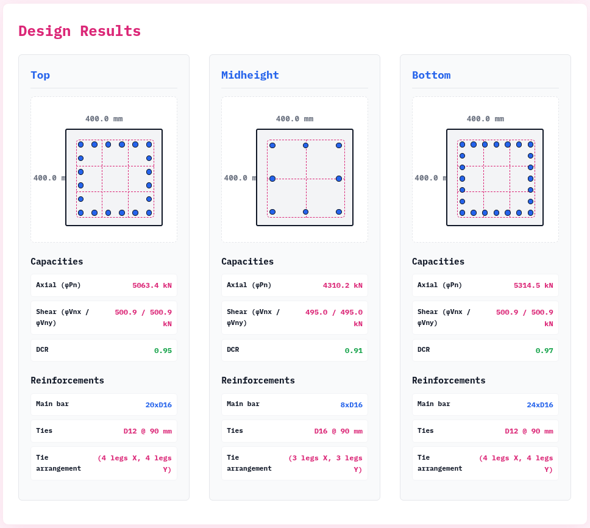
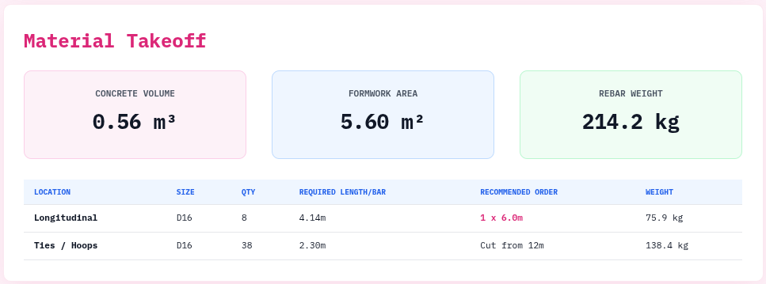

# ACI 318M-25 RC Design Collection
A Python web application for designing reinforced concrete members according to ACI 318M-25 provisions. Written using Air web framework.

## Currently implemented modules

### RC beam design (v0.8 beta)

> [!NOTE]
> This module is in beta. Please try this out and let me know your experience using this. Thanks!

  - Serviceability checks
    
  - Reinforcement details and capacity checks
    - automatically considers constructability requirements
    - automatically considers seismic detailing when required
    
  - Quantity takeoff
    - considers hooks, bends, splices, and commercial bar lengths
    

### RC column design (v0.4 alpha)

> [!WARNING]
> The refinement of this module is ongoing. Please anticipate bugs, wrong results and/or missing features.

- Detailed elevation view of reinforcements
    
- Reinforcement details and capacity checks
    - automatically considers constructability requirements
    - automatically considers seismic detailing when required
    
- Quantity takeoff
    - considers hooks, bends, splices, and commercial bar lengths
    
