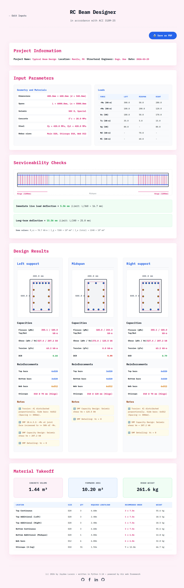
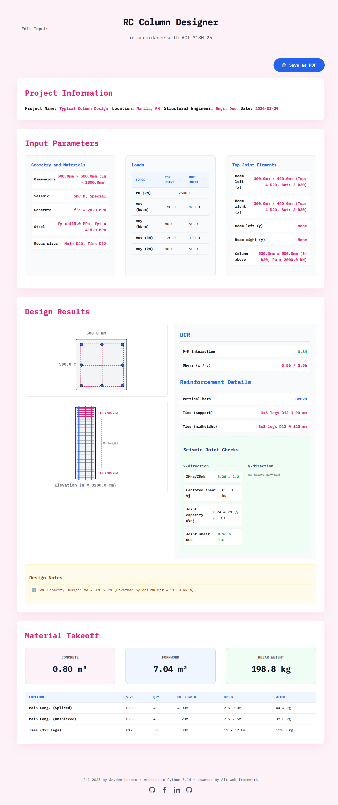
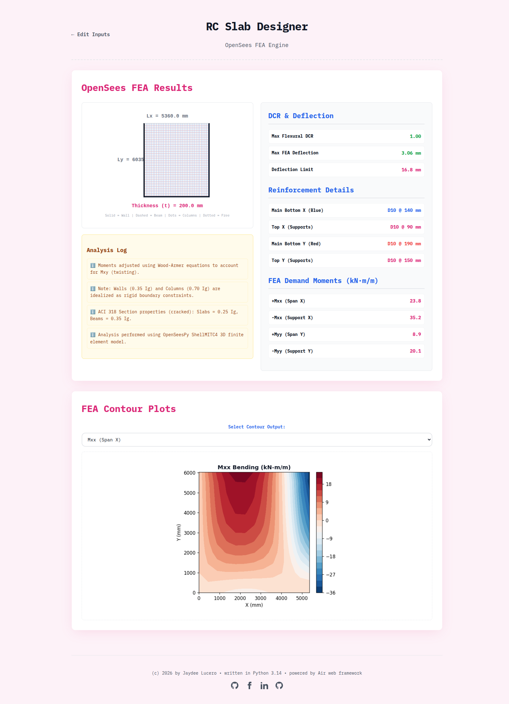

# 🏗️ ACI 318M-25 RC Design Collection

[](https://python.org)
[]()
[](LICENSE)
[]()
[]()
[]()

A powerful Python web application built with the Air web framework for designing reinforced concrete members in accordance with **ACI 318M-25** provisions. 

Perform serviceability checks, generate reinforcement details, and calculate quantity takeoffs, all while ensuring code compliance, including constructability and seismic requirements. Best of all, since this is a web application, you can do the calculations on any device, anytime, anywhere, even while on the go.

The web application can be accessed at [https://rc-design-collection.onrender.com](https://rc-design-collection.onrender.com). (Note that first time access of this website may take a minute or more as I am just using the free tier of Render.)

## 🚀 Features & Modules

### 1. RC Beam Design `(v0.8 Beta)`
*Note: This module is currently in beta. Please try it out and report any feedback or issues!*

* **Detailed Elevation Views:** Visual representations of beam reinforcements.
* **Serviceability Checks:** Immediate live load and long-term deflection checks.
* **Reinforcement Details & Capacity:** * Automatically considers constructability requirements.
  * Automatically applies seismic detailing when required.
* **Quantity Takeoff:** Accurately considers hooks, bends, splices, and standard commercial bar lengths for precise material estimation.

### 2. RC Column Design `(v0.8 Beta)`
*Note: This module is currently in beta. Please try it out and report any feedback or issues!*

* **Detailed Elevation Views:** Visual representations of column reinforcements.
* **Reinforcement Details & Capacity:** * Automatically checks constructability requirements.
  * Adjusts for seismic detailing when applicable.
  * Includes checks for strong-column, weak-beam (SCWB) and joint shear.
* **Quantity Takeoff:** Accurately considers hooks, bends, splices, and standard commercial bar lengths for precise material estimation.

### 3. RC Slab Design `(v0.4 Alpha)`
> [!WARNING]
> This module is currently in alpha. Refinements are ongoing, so please expect bugs, wrong results, missing features and sudden changes.

* **Detailed Plan Views:** Visual representations of slab reinforcements.
* **Reinforcement Details & Capacity:** * Automatically checks constructability requirements.
  * Using finite element analysis (FEA) for more accurate analysis.
* **Contour Plots:** Deflections, moments, shears in slabs.

## 🛠️ Tech Stack

* **Language:** [Python](https://www.python.org/)
* **Web Framework:** [Air](https://airwebframework.org/)
* **Calculation module:** [ACI 318M-25 library](https://github.com/arisa-chan/aci-318m-25) for member designs, [`openseespy`](https://github.com/zhuminjie/OpenSeesPy) for slab analysis, [`matplotlib`](https://matplotlib.org/) for slab contour plot visualization
* **Dependency Management:** `uv` (via `uv.lock` & `pyproject.toml`)

## 💻 Installation & Local Setup

To run this application locally on your machine, follow these steps:

**1. Clone the repository**
```bash
git clone https://github.com/arisa-chan/rc-design-collection-web.git
cd rc-design-collection-web
```

**2. Set up a virtual environment (Optional but recommended)**
```bash
python -m venv venv
source venv/bin/activate  # On Windows use: venv\Scripts\activate
```

**3. Install dependencies**
```bash
pip install -r requirements.txt
# Alternatively, if you use uv:
# uv pip install -r requirements.txt
```
Note that the latest version of Air requires Python 3.13 or 3.14 only.

**4. Run the application**
```bash
air run
```

## 📸 Screenshots

<details>
<summary><b>RC beam design module</b></summary>
<br>



</details>

<details>
<summary><b>RC column design module</b></summary>
<br>



</details>

<details>
<summary><b>RC slab design module</b></summary>
<br>



</details>

## 🤝 Contributing

Contributions, issues, and feature requests are welcome! 
If you find a bug (especially in the Beta modules) or want to add a feature, please feel free to check the [issues page](https://github.com/arisa-chan/rc-design-collection-web/issues) or submit a Pull Request.

## 📄 License

This project is licensed under the **MIT License**. See the [LICENSE](LICENSE) file for more information.

---
*If you find this tool helpful in your engineering workflow, please consider giving it a ⭐!*
